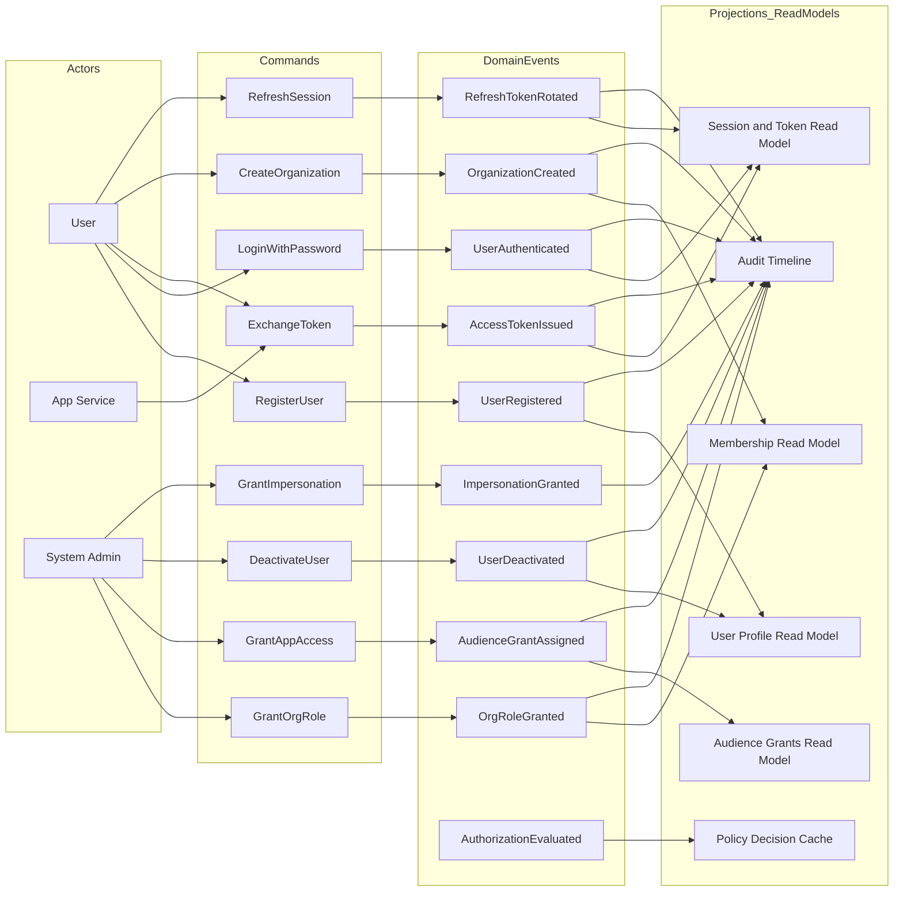

# Identity Event Modeling

This diagram shows the event-driven flow for the identity service from command to event to projection/read model.

## Event Flow

## Aggregate and Event Ownership

- `UserAggregate`
  - `UserRegistered`, `UserAuthenticated`, `UserDeactivated`
- `OrganizationAggregate`
  - `OrganizationCreated`, `OrgRoleGranted`
- `AccessAggregate`
  - `AudienceGrantAssigned`, `AccessTokenIssued`, `RefreshTokenRotated`
- `PolicyAggregate` (or Policy service boundary)
  - `AuthorizationEvaluated`, `ImpersonationGranted`

## Notes

- AuthN-owned flows: `RegisterUser`, `LoginWithPassword`, `RefreshSession`, `ExchangeToken`.
- AuthZ/FGA-owned flows: `GrantOrgRole`, `GrantAppAccess`, `GrantImpersonation`, authorization decisions.
- In monolith mode these boundaries run in one process; after extraction, AuthZ can move behind policy APIs without changing domain call contracts.
- Keep write model append-only and project into read models for app queries.
- Audit events should be emitted for every command that changes auth context.
- FGA/ReBAC checks should produce decision events for traceability.
