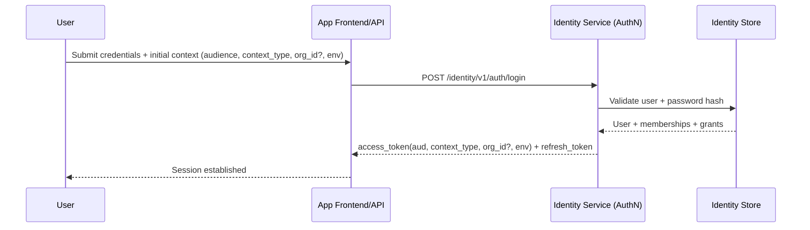
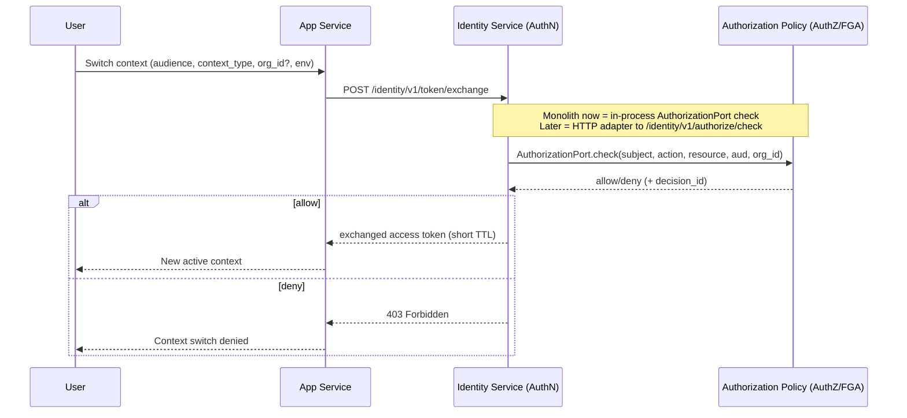
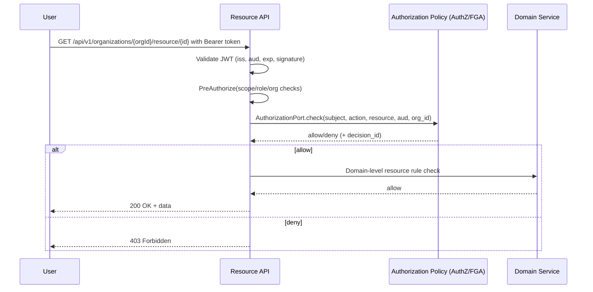
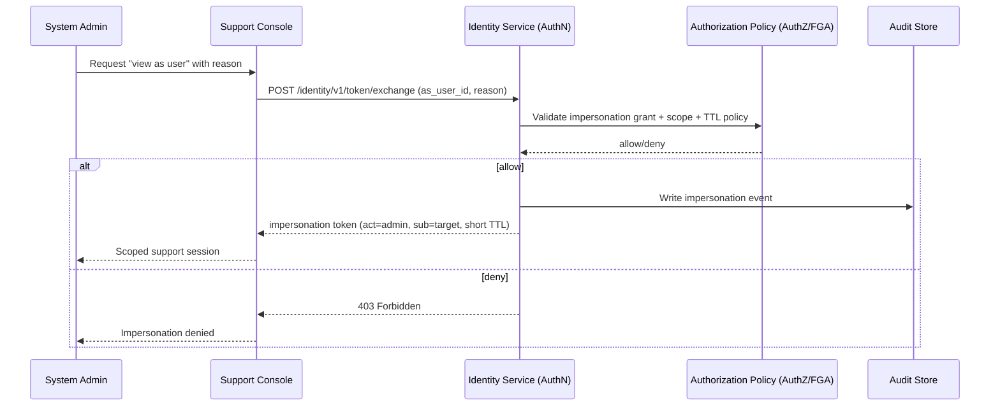

# Identity Sequence Flows

## 1) Login + App-Scoped Token

## 2) Token Exchange for Org/App Context Switch

## 3) API Authorization Check (Scope + Domain Rule)

## 4) Controlled Impersonation (Later Phase)

