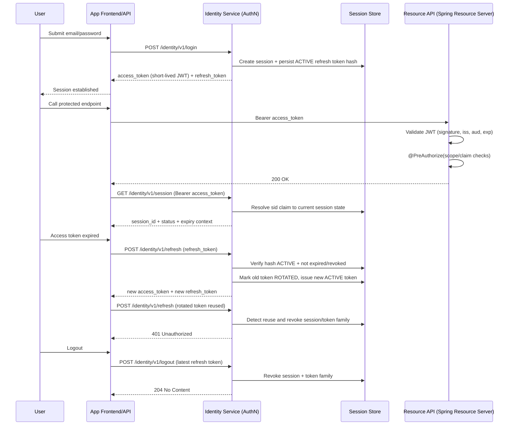
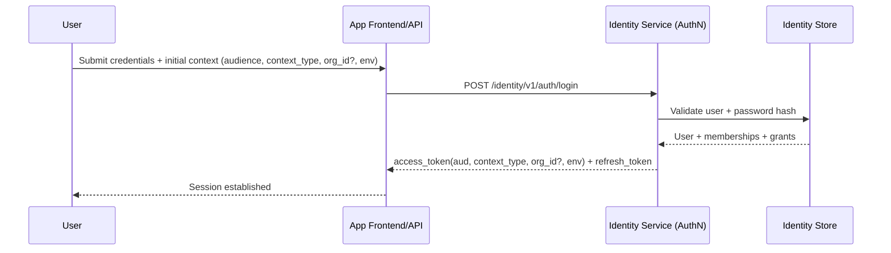
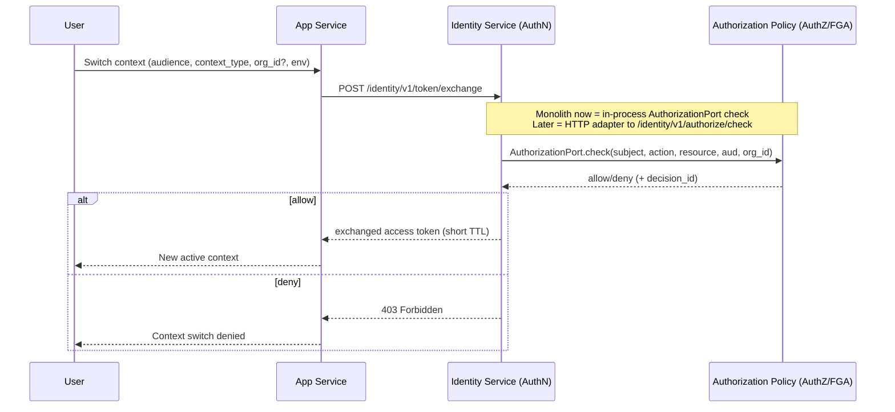
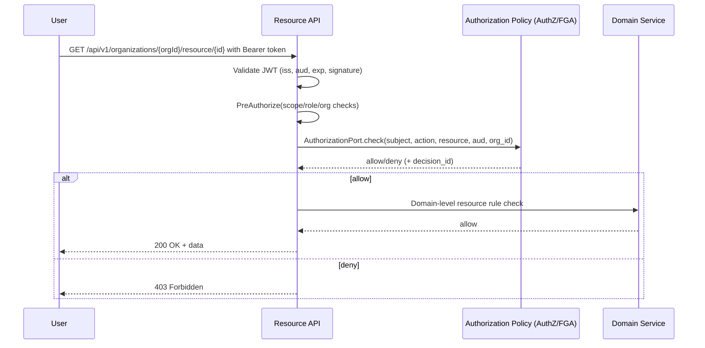
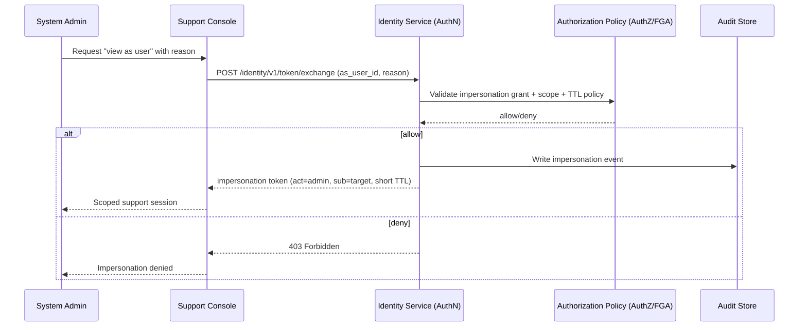

# Identity Sequence Flows

## 1) Login + Access + Refresh + Session Revocation

## 2) Login + App-Scoped Token

## 3) Token Exchange for Org/App Context Switch

## 4) API Authorization Check (Scope + Domain Rule)

## 5) Controlled Impersonation (Later Phase)

