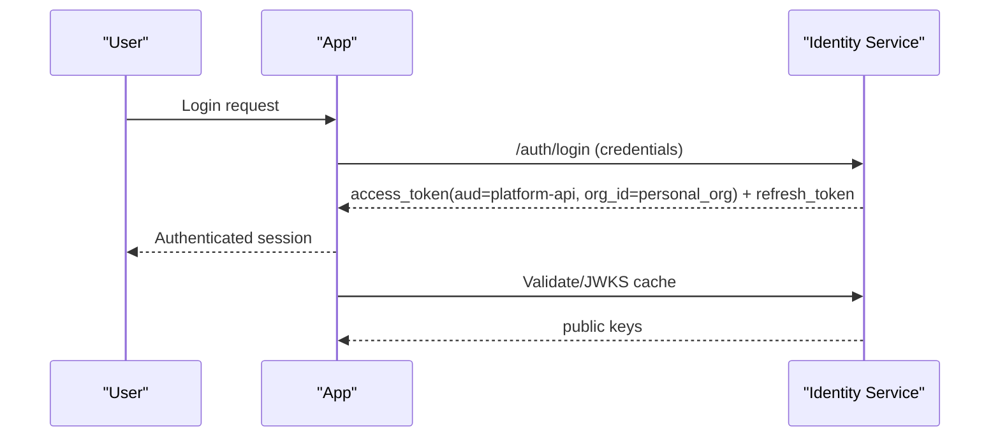
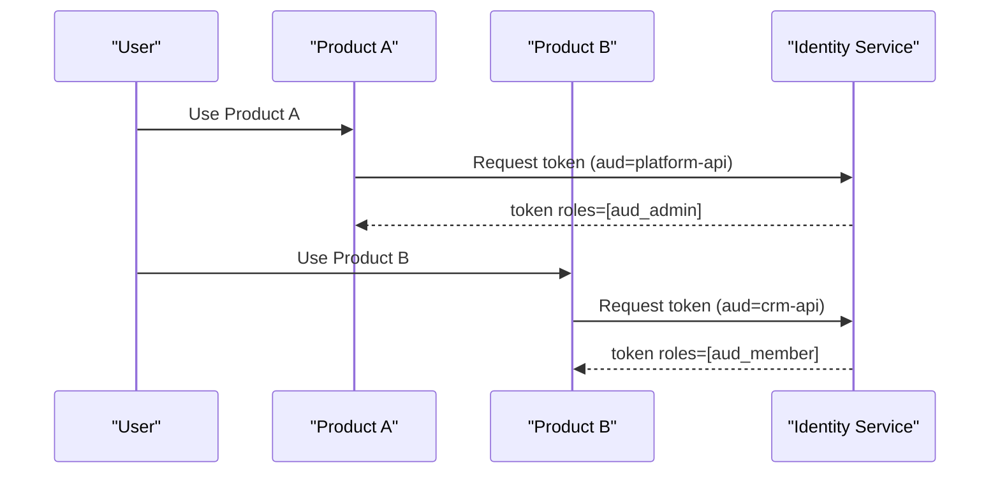
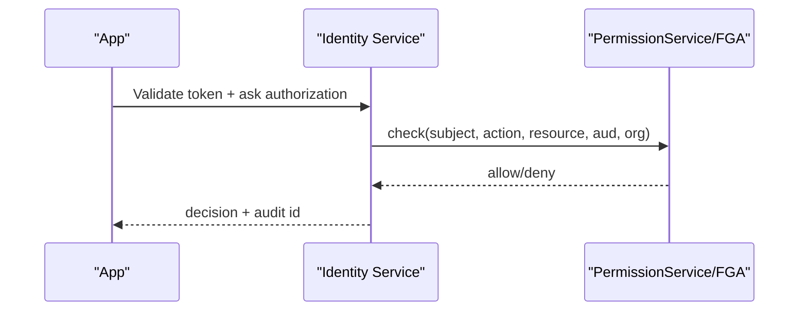
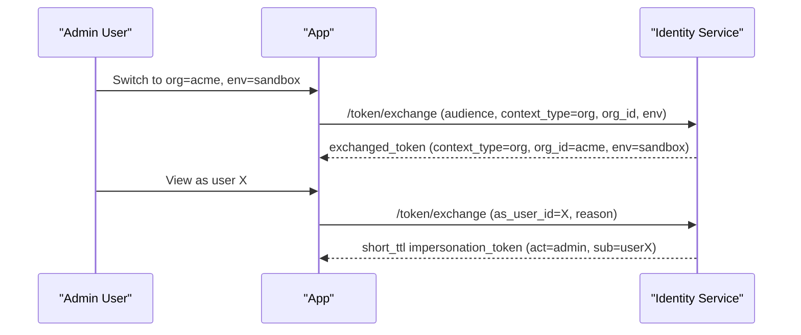
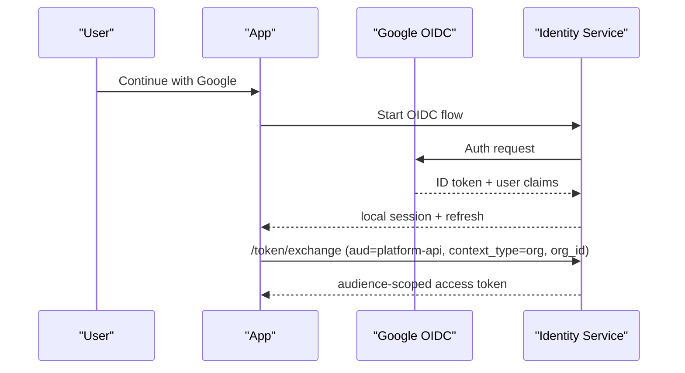

# Identity Service Plan (Phased, App-Agnostic, Token-Context Aware)

This plan is optimized for a fast MVP first, then gradual evolution to enterprise IAM without rework.

## 1. What This Must Support

- A default user can sign up and get basic app access.
- A permanent platform-level `SYSTEM_ADMIN` principal (you) can manage everything.
- Users can be promoted by admins to higher privilege levels.
- A user can belong to multiple organizations.
- A user can have different roles per app and per organization.
- Smaller product modules can be prototyped inside this modular monolith first, then extracted into standalone microservices when ready.
- A user can switch context for:
  - Product audience (`aud`/resource server boundary)
  - Organization
  - Environment (`prod` vs `sandbox`)
  - View-as or impersonation (controlled and audited)
- Apps remain responsible for UI/feature behavior, but identity issues the correct context token.

---

## 2. Recommended Core Architecture

### 2.1 Identity Model

- `User` is global and app-agnostic.
- `Organization` is global and reusable across apps.
- `Audience` represents a protected API boundary (typically one per product app).
- Access is granted via audience-scoped memberships/relations.

### 2.2 Permission Planes

- Platform plane:
  - `SYSTEM_ADMIN` for break-glass and global operations.
- Audience plane:
  - Audience-specific role (`aud_admin`, `aud_member`, `aud_viewer`).
- Org plane:
  - Org-specific role inside an audience (`org_owner`, `org_admin`, `org_member`).

### 2.3 Token Strategy (key to flexibility)

- Session lifecycle:
  - User signs in once and gets refresh/session.
- Access lifecycle:
  - Product app requests short-lived access token for a specific context.
- Token exchange endpoint:
  - Identity issues a token based on requested `audience`, `context_type`, optional `org_id`, `env`, optional `as_user`.

### 2.4 Claims Contract (minimum)

- Always include:
  - `iss`, `sub`, `aud`, `exp`, `iat`, `jti`.
- Context claims:
  - `context_type`, `org_id` (org context), `env`, `roles`, `scope`.
- Impersonation claims (when used):
  - `act` (actor), `sub` (subject), `impersonation=true`, `reason`.

### 2.5 Safety Rules

- No direct cross-module DB coupling; all authz checks via interface/API.
- Every context switch and impersonation is audit logged.
- Impersonation tokens must be very short TTL (for example 5 minutes).
- Do not trust raw headers for tenant or role context without token validation.

### 2.6 App-Agnostic Boundaries (critical)

Identity should stay generic so it can power multiple apps (Gym, CRM, future apps) without schema rewrites.

Identity service owns:
- User identity and credentials:
  - user profile basics, password hash, social identity links, sessions, refresh tokens.
- Authentication and token issuance:
  - login, refresh, logout, JWKS, token exchange.
- Tenant and access context:
  - organizations, memberships, audience grants, scopes, roles, environment context.
- Security governance:
  - audit trail, deactivation, impersonation controls, key rotation.

App-specific services own:
- Domain entities and workflows:
  - anything business-specific to a product domain.
- Domain permissions mapping:
  - how identity roles/scopes map to concrete in-app actions.
- Domain data storage and validation:
  - app data schemas, lifecycle, and business rules.

Gym app examples (app-specific, not identity):
- Gym profile, locations, operating hours.
- Class schedules, trainer assignments, bookings, waitlists.
- Membership plans, billing events, attendance logs.

CRM app examples (app-specific, not identity):
- Leads, accounts, contacts, opportunities.
- Pipeline stages, forecasting, activities/tasks.
- Territory rules, sales playbooks, account notes.

Shared identity examples (used by both Gym and CRM apps):
- "User 123 is `org_admin` in Org A for Gym app."
- "User 123 is `aud_member` in Org B for CRM app."
- "User 123 can switch active context to Org B and request a CRM token."
- "Support admin impersonated User 123 for 5 minutes with audit reason."

Practical integration contract:
- Apps send users to Identity for login and token exchange.
- Apps validate JWT and enforce tenant scoping using `aud`, `org_id`, `scope`, `roles`.
- Apps never store passwords or run their own auth system.
- Identity never stores domain tables like `classes`, `leads`, or `opportunities`.

### 2.7 Anti-Patterns to Avoid

- Putting app domain data in identity tables (`gym_locations`, `crm_leads`, `class_schedule`).
- Letting each app implement its own custom login/password system.
- Issuing long-lived access tokens without refresh rotation and revocation controls.
- Trusting `X-Tenant-ID`/`X-Org-ID` headers without token claim verification.
- Skipping `aud` (audience) validation in resource services.
- Encoding huge permission payloads in JWT instead of checking policy/relations server-side.
- Using `SYSTEM_ADMIN` for normal daily app operations.
- Allowing impersonation without explicit grant, reason, and audit event.

### 2.8 Logical Service Boundaries (AuthN vs AuthZ/FGA)

For now, both concerns live in the same `identity` module (modular monolith), but they should be separated by interface and package boundaries so they can split later.

AuthN service boundary (who you are):
- credentials and external identities
- login, refresh, logout, session lifecycle
- OAuth client registration and token issuance
- JWKS / signing key lifecycle

AuthZ service boundary (what you can do):
- org memberships and audience grants
- relation tuples and policy checks
- `SYSTEM_ADMIN` global authorization
- authorization decision audit trail

Target extraction path:
- keep AuthN and AuthZ in one deployable unit initially
- define AuthZ as an internal `Role/FGA Policy Service` boundary now
- extract `Role/FGA Policy Service` into a separate microservice later without changing app-facing contracts

Recommended runtime check flow:
1. API validates token signature, `exp`, and `aud`.
2. API validates tenant context (`org_id`) for tenant endpoints.
3. API enforces coarse scopes/roles (`@PreAuthorize`).
4. Domain service calls policy check (`subject`, `action`, `resource`, `aud`, `org_id`).
5. FGA/policy engine returns allow or deny.
6. API/domain service applies domain-state rule checks.
7. Decision is audited for traceability.

### 2.9 FGA Best Practices for This Project

- default deny on missing or ambiguous policy
- policy-as-code model versioned in git
- small JWT claims, policy decisions done server-side
- explicit context type (`ctx=platform|org`) to avoid null-context bugs
- short-lived decision cache + invalidation on membership/grant changes
- outbox/event pattern when syncing grants to FGA backend
- batch authorization checks for list endpoints to avoid N+1 checks
- auditable sensitive decisions (system-admin actions, impersonation, financial writes)

### 2.10 Supported Login Styles and Required Structure

Supported login styles:
- email/password + refresh rotation
- social OIDC (Google first)
- enterprise federation later (OIDC/SAML)
- machine-to-machine (`client_credentials`)

Core structures required:
- users and credential providers
- organizations and memberships
- audiences and audience grants
- oauth clients (public PKCE + confidential secret-based)
- sessions and refresh token rotation state
- relations/tuples for FGA checks
- audit events for auth and policy decisions

Design note:
- keep AuthN/AuthZ as separate logical services inside monolith now
- expose stable internal interfaces and HTTP contracts
- later extract AuthZ/FGA into its own deployable service if needed

### 2.11 Repository and Module Call Strategy (Now vs Later)

Recommended now (modular monolith):
- keep Identity/AuthN/AuthZ in the same repository
- keep modules separated by Gradle boundaries and package boundaries
- use in-process calls between modules (Spring interfaces/beans), not internal HTTP
- reserve HTTP endpoints for frontend clients and external integrations

Recommended internal contract shape:
- `identity-contract` (or equivalent package): interfaces + request/response models
- `identity-impl`: concrete implementation in the `identity` module
- domain modules depend only on contract, never identity persistence internals

Monolith in-process example:
```kotlin
interface AuthorizationPort {
    fun check(subjectId: String, action: String, resource: String, aud: String, orgId: String?): Boolean
}

@Service
class InvoiceService(private val authorizationPort: AuthorizationPort) {
    fun refund(invoiceId: String, callerId: String, aud: String, orgId: String) {
        val allowed = authorizationPort.check(callerId, "refund", "invoice:$invoiceId", aud, orgId)
        require(allowed) { "Forbidden" }
        // domain logic
    }
}
```

Extraction-ready adapter pattern:
- keep domain code calling `AuthorizationPort`
- swap implementation from in-process bean to HTTP adapter later
- no domain API changes required

After extraction example:
```kotlin
@Service
class HttpAuthorizationAdapter(private val identityClient: IdentityPolicyClient) : AuthorizationPort {
    override fun check(subjectId: String, action: String, resource: String, aud: String, orgId: String?): Boolean {
        return identityClient.check(subjectId, action, resource, aud, orgId).allow
    }
}
```

Concrete call-flow examples:
- Same repo/runtime (today):
  1. Request hits `orders` controller with JWT.
  2. `orders` service calls `AuthorizationPort.check(...)`.
  3. In-process `identity` implementation evaluates role/FGA policy.
  4. `orders` continues or returns `403`.
- Extracted identity service (later):
  1. Request hits `orders` controller with JWT.
  2. `orders` service calls `AuthorizationPort.check(...)`.
  3. HTTP adapter calls `POST /identity/v1/authorize/check`.
  4. Identity returns `allow/deny` (+ decision metadata).
  5. `orders` continues or returns `403` and logs decision metadata.

What does not change across both modes:
- domain services still call `AuthorizationPort`
- authorization request shape (`subject`, `action`, `resource`, `aud`, `org_id`)
- endpoint-level security (`@PreAuthorize`) and domain-level authorization checks

When to split into separate repo/service:
- independent deploy cadence is required
- dedicated team ownership is needed
- scaling/security/compliance requires isolation
- policy API contract is stable and well-covered by tests

### 2.12 Initial Auth/AuthZ Package Scaffold (No-Code)

Current scaffold inside `services/identity` (directory-only, no implementation yet):

```text
com/platformdemo/identity/
  auth/
    api/
    application/
    domain/
    infrastructure/
  authz/
    api/
    application/
    domain/
    infrastructure/
    fga/
  shared/
    contracts/
    model/
```

Rationale:
- Keeps AuthN (`auth`) and AuthZ policy (`authz`) boundaries explicit from day one.
- Allows incremental implementation without restructuring imports later.
- Supports the extraction path where `authz` can move behind a service boundary first.

---

## 3. Phased Roadmap

### Phase 0: Bootstrap Security (very fast)
Goal: establish non-negotiable guardrails.

- Seed/create a platform `SYSTEM_ADMIN` user via startup migration and env vars.
- Add audit event table and basic auth events.
- Add signing keys and JWKS endpoint.
- Seed one frontend OAuth public client (`client_id`) for your primary UI.

Exit criteria:
- `SYSTEM_ADMIN` always exists and can be recovered safely.
- Services can validate JWT through JWKS.

### Phase 1: MVP (users, orgs, basic tokens)
Goal: ship working auth quickly.

- Email/password register + login + refresh + logout.
- Auto-create personal organization at sign-up.
- Allow user to join additional orgs via invite later.
- Issue audience-scoped access token for one product audience at a time.
- Basic role model:
  - `org_owner`, `org_admin`, `org_member`.

Exit criteria:
- User can sign up, log in, get token for `aud=platform-api`, and call APIs in that audience.
- User can belong to multiple orgs.
- Deactivated users cannot mint new tokens.

### Phase 2: Audience-Aware Access and Client Credentials
Goal: support multi-product access differences and machine access.

- Add `audiences` registry (one audience per product app boundary).
- Add audience-specific grants so same user can be admin in one audience and member in another.
- Add OAuth confidential clients + `client_credentials`.
- Enforce audience and scope strictly.

Exit criteria:
- Same user can hold different roles across audiences.
- M2M tokens work with scoped permissions.

### Phase 3: ReBAC/FGA Foundation
Goal: upgrade from static roles to relationship-based checks.

- Introduce tuple-based relations for audience/org/resource permissions.
- Keep `PermissionService` as stable abstraction.
- Move existing role checks behind relation checks.
- Add centralized check endpoints (`/authorize/check`, `/authorize/batch-check`) for service-to-service authorization queries.
- Prepare model compatible with OpenFGA.
- Keep policy APIs transport-neutral so the same contract works before and after extraction to a standalone Role/FGA service.

Exit criteria:
- At least one app enforces authorization through relation checks.
- Role inheritance and special support relations are modeled.
- Role/FGA boundary is isolated enough that extraction to a standalone service is a packaging/deployment change, not an API redesign.

### Phase 4: Context Switching and Controlled Impersonation
Goal: support view switching, sandbox context, and support/admin troubleshooting.

- Add `POST /identity/v1/token/exchange` to request token by context:
  - `audience`, `context_type`, optional `org_id`, `env`, `requested_role`, optional `as_user_id`.
- Support "view as role" (same user, different allowed role context).
- Support impersonation only for authorized admins/support with mandatory reason.
- Add strict audit trail and easy revoke for exchanged tokens.

Exit criteria:
- User can switch between orgs/audiences without re-auth.
- Admin/support can impersonate with auditable constraints.
- Sandbox tokens are isolated by `env=sandbox` claim.

### Phase 5: Enterprise Features
Goal: federation and hardening.

- Google OIDC login first, then other OIDC providers.
- Session/device management and key rotation with `kid`.
- Optional OpenFGA backend switch.
- Later enterprise SSO (SAML/OIDC) after OIDC and token exchange are stable.

Exit criteria:
- Social login works with safe account linking.
- Production controls in place (audit, rotation, revocation, alerts).

---

## 4. API Contract (Version 1)

Auth (synchronous):
- `POST /identity/v1/auth/login`
- `POST /identity/v1/auth/refresh`
- `POST /identity/v1/auth/logout`
- `POST /identity/v1/token/exchange`

Async write API (event-first, asynchronous):
- `POST /v1/register-user`
- `POST /v1/create-organization`
- `POST /v1/invite-organization-member`
- `POST /v1/assign-organization-role`
- `POST /v1/create-audience-grant`
- `POST /v1/revoke-audience-grant`
- `POST /v1/create-impersonation-grant`
- `POST /v1/deactivate-user`

Query API (read models and policy decisions):
- `GET /identity/v1/me`
- `GET /v1/commands/{commandId}`
- `GET /v1/users/{userId}`
- `GET /identity/v1/organizations/{orgId}/members/{userId}`
- `GET /identity/v1/audiences/{audience}/grants`
- `POST /identity/v1/authorize/check`
- `POST /identity/v1/authorize/batch-check`

Event API:
- `GET /identity/v1/events`
- `GET /identity/v1/events/{eventId}`
- `GET /identity/v1/events/stream`

Notes:
- Most writes should go through asynchronous write endpoints and emit events.
- Keep this contract stable so the module can be extracted with minimal integration changes.

---

## 5. Data Model (Evolvable)

- `users`: id, email, password_hash, status, email_verified, created_at, updated_at.
- `organizations`: id, slug, name, status, created_by.
- `audiences`: id, key, name, status. One per product app boundary.
- `org_memberships`: id, user_id, organization_id, role, status.
- `audience_grants`: id, subject_type(user/client), subject_id, audience, org_id(nullable), role, scopes, status.
- `oauth_clients`: id, client_id, client_secret_hash(nullable for public clients), client_type(public|confidential), allowed_audiences, allowed_scopes, status.
- `sessions`: id, user_id, device_info, ip_hash, created_at, revoked_at.
- `refresh_tokens`: id, session_id, token_hash, expires_at, rotated_from, revoked_at.
- `relations`: object_type, object_id, relation, subject_type, subject_id, tenant_id, expires_at(nullable).
- `impersonation_grants`: id, actor_user_id, target_scope, allowed, expires_at, created_by.
- `audit_events`: id, event_type, actor_id, subject_id, audience, org_id, metadata(jsonb), created_at.

Defaults:
- Auto-create personal org on first signup.
- Allow invite/join to additional orgs.
- Support both platform-owned and tenant-owned OAuth clients.

### Super Admin Org Strategy

- `SYSTEM_ADMIN` is a global/platform permission and should not require a fixed `org_id`.
- Also create a personal org for day-to-day non-privileged usage.
- Recommended seed shape:
  - global `SYSTEM_ADMIN` grant with `org_id = null`
  - personal org membership with `org_owner`
  - switch into target org context through token exchange for tenant-specific operations

---

## 6. Free/Open-Source Stack

- Spring Security
- Spring Authorization Server
- Spring Security OAuth2 Client (Google in Phase 5)
- PostgreSQL
- Flyway OSS
- Redis (optional for revocation/cache)
- OpenFGA (optional backend in later phase)
- Testcontainers

---

## 7. Sequence Workflows by Phase

### Phase 1: Sign-in and audience token



### Phase 2: Same user, different audience role



### Phase 3: ReBAC policy check



### Phase 4: Context switch (org/env/impersonation)



### Phase 5: Google login



---

## 8. Immediate Build Plan (next sprint)

1. Implement Phase 0 and Phase 1 only.
2. Add `audiences` and `audience_grants` early, even with simple role rules.
3. Implement token exchange endpoint in a limited form:
   - `audience`, `context_type`, optional `org_id`, `env`
   - no impersonation yet
4. Add audit records for login, refresh, role change, token exchange.
5. Add integration tests for:
   - audience-specific role differences
   - multi-org membership
   - sandbox claim isolation
   - `SYSTEM_ADMIN` override behavior

---

## 9. Decisions Locked for Now

1. User signup auto-creates a personal org.
2. Users can join additional orgs by invite.
3. Identity supports both platform-owned and tenant-owned clients.
4. OpenFGA is introduced after internal relation model stabilizes.

---

## 10. Spring Boot App Integration (Industry-Normal Pattern)

This is how any app service (Gym, CRM, etc.) should consume the Identity handler.

### 10.1 Add dependencies to the app service

```kotlin
// services/app/build.gradle.kts
dependencies {
    implementation("org.springframework.boot:spring-boot-starter-security")
    implementation("org.springframework.boot:spring-boot-starter-oauth2-resource-server")
    testImplementation("org.springframework.security:spring-security-test")
}
```

### 10.2 Configure JWT validation in `application.yml`

```yaml
security:
  identity:
    issuer: ${IDENTITY_ISSUER_URI:http://identity-service:8080}
    audience: ${IDENTITY_AUDIENCE:platform-app}

spring:
  security:
    oauth2:
      resourceserver:
        jwt:
          issuer-uri: ${security.identity.issuer}
```

Notes:
- `issuer-uri` lets Spring load OIDC metadata + JWKS automatically.
- You should still enforce required audience in code.

### 10.3 Security configuration in Spring Boot (Kotlin)

```kotlin
package com.platformdemo.app.security

import org.springframework.beans.factory.annotation.Value
import org.springframework.context.annotation.Bean
import org.springframework.context.annotation.Configuration
import org.springframework.core.convert.converter.Converter
import org.springframework.security.authentication.AbstractAuthenticationToken
import org.springframework.security.config.annotation.method.configuration.EnableMethodSecurity
import org.springframework.security.config.annotation.web.builders.HttpSecurity
import org.springframework.security.core.authority.SimpleGrantedAuthority
import org.springframework.security.oauth2.core.OAuth2Error
import org.springframework.security.oauth2.core.OAuth2TokenValidator
import org.springframework.security.oauth2.core.OAuth2TokenValidatorResult
import org.springframework.security.oauth2.core.DelegatingOAuth2TokenValidator
import org.springframework.security.oauth2.jwt.Jwt
import org.springframework.security.oauth2.jwt.JwtDecoder
import org.springframework.security.oauth2.jwt.JwtDecoders
import org.springframework.security.oauth2.jwt.JwtValidators
import org.springframework.security.oauth2.jwt.NimbusJwtDecoder
import org.springframework.security.oauth2.server.resource.authentication.JwtAuthenticationToken
import org.springframework.security.web.SecurityFilterChain
import java.util.Collection

@Configuration
@EnableMethodSecurity
class ApiSecurityConfig(
    @Value("\${security.identity.issuer}") private val issuer: String,
    @Value("\${security.identity.audience}") private val audience: String
) {
    @Bean
    fun securityFilterChain(http: HttpSecurity): SecurityFilterChain {
        http
            .csrf { it.disable() }
            .authorizeHttpRequests {
                it.requestMatchers("/actuator/health").permitAll()
                it.anyRequest().authenticated()
            }
            .oauth2ResourceServer { oauth2 ->
                oauth2.jwt { jwt ->
                    jwt.decoder(jwtDecoder())
                    jwt.jwtAuthenticationConverter(jwtAuthenticationConverter())
                }
            }
        return http.build()
    }

    @Bean
    fun jwtDecoder(): JwtDecoder {
        val decoder = JwtDecoders.fromIssuerLocation(issuer) as NimbusJwtDecoder
        val issuerValidator = JwtValidators.createDefaultWithIssuer(issuer)
        val audienceValidator = OAuth2TokenValidator<Jwt> { jwt ->
            if (jwt.audience.contains(audience)) {
                OAuth2TokenValidatorResult.success()
            } else {
                OAuth2TokenValidatorResult.failure(
                    OAuth2Error("invalid_token", "Missing required audience", null)
                )
            }
        }
        decoder.setJwtValidator(
            DelegatingOAuth2TokenValidator(issuerValidator, audienceValidator)
        )
        return decoder
    }

    @Bean
    fun jwtAuthenticationConverter(): Converter<Jwt, out AbstractAuthenticationToken> {
        return Converter { jwt ->
            val scopeAuthorities = when (val raw = jwt.claims["scope"]) {
                is String -> raw.split(" ").filter { it.isNotBlank() }
                is Collection<*> -> raw.filterIsInstance<String>()
                else -> emptyList()
            }.map { SimpleGrantedAuthority("SCOPE_$it") }

            val roleAuthorities = (jwt.claimAsStringList("roles") ?: emptyList())
                .map { SimpleGrantedAuthority("ROLE_${it.uppercase()}") }

            JwtAuthenticationToken(jwt, scopeAuthorities + roleAuthorities, jwt.subject)
        }
    }
}
```

### 10.4 Controller-level authorization with built-in annotations

```kotlin
package com.platformdemo.app.api

import org.springframework.security.core.Authentication
import org.springframework.security.oauth2.jwt.Jwt
import org.springframework.security.access.prepost.PreAuthorize
import org.springframework.web.bind.annotation.GetMapping
import org.springframework.web.bind.annotation.PathVariable
import org.springframework.web.bind.annotation.RequestMapping
import org.springframework.web.bind.annotation.RestController

@RestController
@RequestMapping("/api/v1/organizations/{orgId}/classes")
class ClassController(
    private val tenantAccess: TenantAccess
) {
    @GetMapping
    @PreAuthorize("hasAuthority('SCOPE_classes:read') and @tenantAccess.canAccessOrg(authentication, #orgId)")
    fun list(@PathVariable orgId: String): List<String> = listOf()

    @GetMapping("/admin")
    @PreAuthorize("(hasRole('SYSTEM_ADMIN') or hasRole('ORG_ADMIN') or hasRole('ORG_OWNER')) and hasAuthority('SCOPE_classes:write') and @tenantAccess.canAccessOrg(authentication, #orgId)")
    fun adminView(@PathVariable orgId: String): String = "ok"
}

@org.springframework.stereotype.Component("tenantAccess")
class TenantAccess {
    fun canAccessOrg(authentication: Authentication, orgId: String): Boolean {
        val jwt = authentication.principal as? Jwt ?: return false
        val tokenOrgId = jwt.claimAsString("org_id")
        val isSystemAdmin = authentication.authorities.any { it.authority == "ROLE_SYSTEM_ADMIN" }
        return isSystemAdmin || tokenOrgId == orgId
    }
}
```

### 10.5 Controller vs service responsibility

- Controller checks:
  - authentication exists
  - required scope/role via `@PreAuthorize`
  - org/audience context matches request path
- Service checks:
  - resource-level decisions (`can edit class 42?`)
  - policy checks through `PermissionService` (later backed by relations/FGA)

### 10.6 Suggested token claims expected by app services

- Required:
  - `sub`, `aud`, `exp`, `jti`, `org_id`, `scope`, `roles`
- Optional:
  - `env` (`prod` or `sandbox`)
  - `act` and `impersonation` for view-as flows

---

## 11. Role/Permission APIs and Resource Authorization Boundaries

### 11.1 Do we need APIs to create roles and permissions?

Recommended approach:
- Start with role and scope catalogs as code/config + Flyway seed data.
- Add APIs for assigning grants, not defining new role types, in early phases.
- Add dynamic role-definition APIs later only if you truly need tenant-custom roles.

Why:
- Keeps policy surface stable and auditable while the platform matures.
- Avoids accidental permission sprawl from fully dynamic role creation too early.

Early-phase APIs you should have:
- Grant/revoke membership roles:
  - `POST /identity/v1/organizations/{orgId}/members/{userId}/roles`
- Grant/revoke audience roles/scopes:
  - `POST /identity/v1/audiences/{audience}/grants`
  - `DELETE /identity/v1/audiences/{audience}/grants/{grantId}`
- Token context switching:
  - `POST /identity/v1/token/exchange`

Optional later admin APIs:
- `POST /identity/v1/admin/role-definitions`
- `POST /identity/v1/admin/scope-definitions`

If added, these should be:
- system-admin only
- versioned
- fully audited
- validated against naming conventions and reserved keywords

### 11.2 Does Identity provide resource access too?

Use a layered model:
- Identity provides coarse-grained access context:
  - who the caller is
  - which audience/org/env they are acting in
  - high-level roles/scopes/relations
- Domain services provide resource-level authorization:
  - "can edit class 42?"
  - "can view lead 918?"
  - "can refund invoice 3001?"

Pattern:
- Controller does auth + scope/org gate.
- Domain service does resource rule checks.
- Domain service may call `PermissionService` (and later OpenFGA) for relation checks.

Rule of thumb:
- If decision depends on domain object state/content, it belongs in domain service.
- If decision is identity/membership/context-based, it belongs in identity/policy layer.
